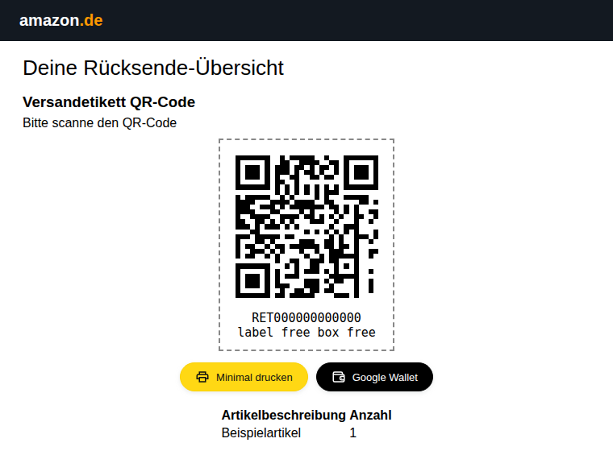

# Amazon Return Label Printer

**Tired of wasting paper when printing Amazon return labels? Or of printing at all?**
This Firefox and Chrome add-on puts two buttons right under your Amazon.de return label: **print only what matters** on one page, or **drop the return QR code straight into Google Wallet** and show it at the DHL counter from your phone.

<p align="center"></p>

👉 **Available on the Firefox Add-on Store:**
[https://addons.mozilla.org/en-US/firefox/addon/amazon-return-label-printer/](https://addons.mozilla.org/en-US/firefox/addon/amazon-return-label-printer/)

---

## ✂️ What It Does

* Leaves the Amazon page as it is and adds two buttons **directly below the label**
* 🖨️ **Minimal drucken**: prints only the **return label or QR code**, the **item table** and the overview, on **one A4 portrait page**, no Amazon UI, no instructions
* 📱 **Google Wallet**: for paperless "label free box free" returns, saves the **QR code as a Wallet pass** with return number, carrier and expiry date. One tap, no screenshots, no paper
* Works with **multiple return labels** on one page

---

## 🖨️ Why It Matters

Amazon’s return label view is cluttered and poorly optimized for printing. The default print layout often spans **two pages**, wasting paper and causing confusion.

This extension fixes that by showing only the **essential information**:

* ✅ Save paper
* ✅ Print faster
* ✅ Avoid cutting or taping pages together
* ✅ Focus only on what matters: **label + item info**

---

## 🗺️ Optimized For

* **Amazon.de** return label pages
* Firefox Desktop
* Chrome / Edge Desktop (load unpacked, see below)

---

## 🚀 Installation (Temporary for Development)

Build first: `npm install && npm run build`.

**Firefox:** open `about:debugging`, click **"This Firefox"**, **"Load Temporary Add-on"** and select `build/firefox/manifest.json`.

**Chrome / Edge:** open `chrome://extensions`, enable **Developer mode**, click **"Load unpacked"** and select `build/chrome/`.

---

## 🔧 Development

One source tree, two browsers:

* `src/content.js`: Core logic for modifying the page
* `src/styles.css`: Print view styling
* `manifests/base.json`: Shared manifest keys; `manifests/firefox.json` (Manifest V2) and `manifests/chrome.json` (Manifest V3) add the per-browser parts

```bash
npm run build          # build/<browser>/ and dist/amazon-return-print-<browser>-<version>.zip
npm run lint:firefox   # web-ext lint on build/firefox
npm run check:chrome   # loads build/chrome in headless Chromium
```

After changes, run `npm run build` and reload the extension in `about:debugging` or `chrome://extensions`.

---

## 📱 Google Wallet (QR-code returns)

For "label free box free" returns Amazon shows a QR code instead of a label. **Google Wallet** turns it into a pass on your phone:

1. The extension loads the QR image in the background and decodes it (the payload is kept byte for byte).
2. It reads the DHL return number and expiry date from it.
3. The shared [`wallet-service`](wallet-service/README.md) at `wallet.infraviored.com` signs a Google Wallet pass with exactly that QR code, and the "Save to Google Wallet" page opens.

Nothing to configure. Privacy: only the QR content, return number, carrier, expiry date and the item title are sent to the service; it stores nothing.

> The Wallet issuer is still in Google's demo mode, so for now only registered test accounts can save passes.

---

## 🐞 Known Issues

* Only supports **Amazon.de** (German return portal)
* May require fine-tuning for unusual screen resolutions

---

## 🪪 License

MIT License – Free to use, share, and improve.
